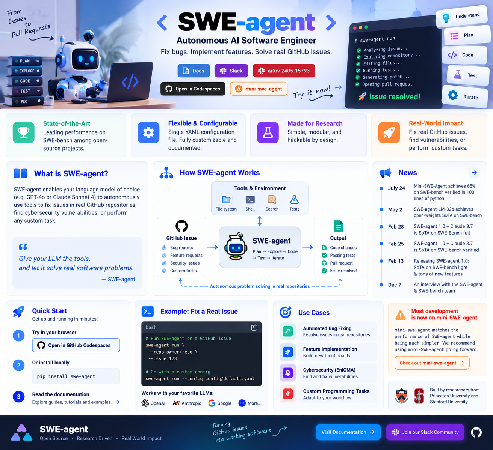
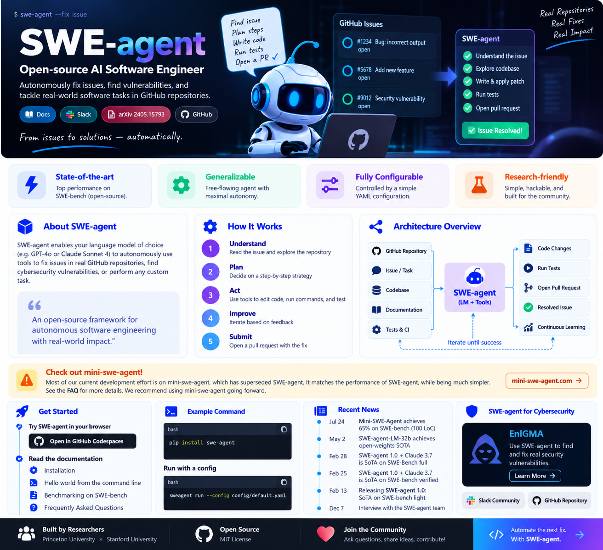
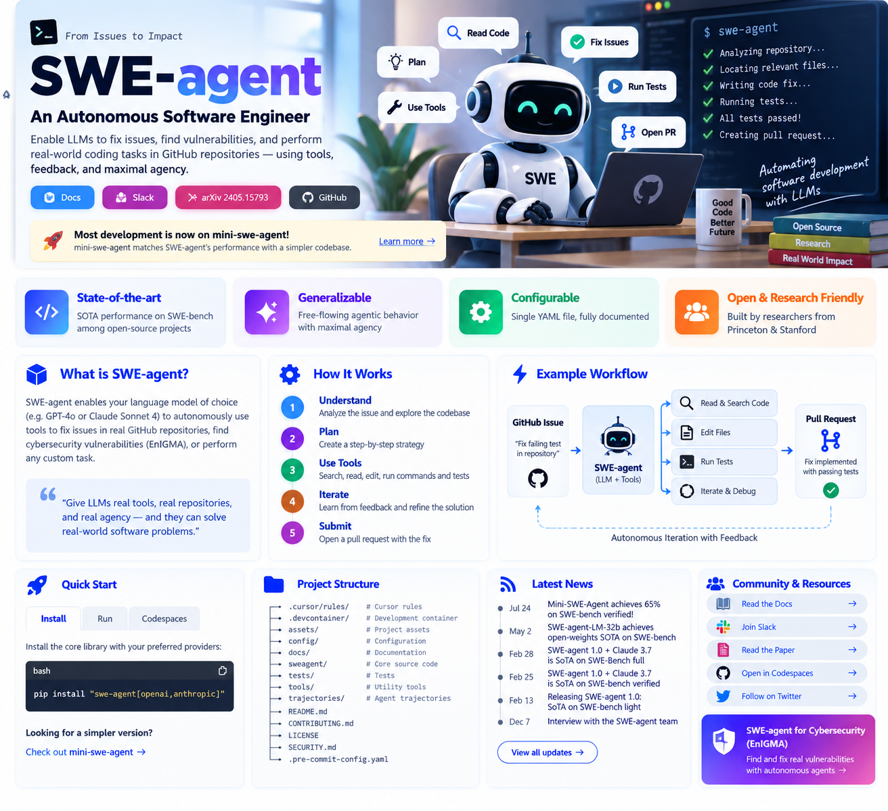

# SWE-agent — Autonomous AI Software Engineer

<p align="center">
  
</p>

<p align="center">
  <strong>Give a language model a real repository, real tools, and a real software task.</strong><br/>
  SWE-agent is a research-oriented framework for autonomous software engineering across issue resolution, code modification, testing, benchmarking, and custom repository tasks.
</p>

<p align="center">
  <a href="#overview">Overview</a> •
  <a href="#what-swe-agent-does">Capabilities</a> •
  <a href="#autonomous-software-engineering-loop">Workflow</a> •
  <a href="#architecture">Architecture</a> •
  <a href="#getting-started">Getting Started</a> •
  <a href="#repository-structure">Repository</a> •
  <a href="#research--evaluation">Research</a> •
  <a href="#license">License</a>
</p>

<p align="center">
  
  
  
  
  
</p>

---

> [!IMPORTANT]
> **Current project direction:** most active development has moved to **mini-SWE-agent**, which the project describes as a much simpler successor that matches SWE-agent performance. SWE-agent remains valuable as a research-oriented, configurable, and hackable autonomous software-engineering framework.

---

## Overview

**SWE-agent** enables a language model to autonomously use software-development tools inside real repositories.

Instead of only generating code in a chat response, the agent can operate through an iterative engineering process that involves:

- understanding a software issue or task
- exploring a repository
- reading source files
- running commands
- modifying code
- validating changes
- using test feedback
- iterating toward a solution

The project is designed to leave substantial agency to the underlying language model while keeping the execution environment and behavior configurable.

Its primary characteristics are:

- **state-of-the-art research performance** on SWE-bench among open-source projects
- **generalizable agent behavior** with high LM autonomy
- **configuration through YAML**
- **simple and hackable research-oriented design**

---

## What SWE-agent Does

<p align="center">
  
</p>

### Automated Issue Resolution

Give the agent:

```text
Repository
+
Issue / Task Description
```

and allow it to investigate the codebase and work toward a solution.

Typical tasks include:

- fixing implementation bugs
- resolving failing behavior
- modifying existing features
- implementing requested functionality
- investigating repository-level problems

### Custom Software Tasks

The framework is intentionally general rather than hard-coded to one benchmark or issue format.

It can be adapted for:

- coding challenges
- repository maintenance
- research experiments
- automated software-engineering workflows
- tool-using language-model experiments

### Security Research Mode

The SWE-agent ecosystem also includes **EnIGMA**, a mode focused on offensive cybersecurity benchmark tasks and CTF research.

Use security functionality only for systems, repositories, challenges, and environments where testing is explicitly authorized.

---

## Autonomous Software Engineering Loop

A typical SWE-agent run follows an iterative feedback loop:

```text
Issue / Task
     ↓
Understand
     ↓
Explore Repository
     ↓
Plan
     ↓
Read / Search Code
     ↓
Modify Files
     ↓
Run Commands / Tests
     ↓
Inspect Feedback
     ↓
Refine Solution
     ↓
Final Patch / Result
```

Unlike a one-shot code generator, the agent can repeatedly inspect the consequences of its own actions.

This matters because real software issues often require:

- locating the correct implementation
- understanding project structure
- discovering dependencies
- checking test failures
- revising incomplete patches
- validating the final result

---

## Architecture

<p align="center">
  
</p>

At a high level:

```text
Software Task
    │
    ▼
Language Model
    │
    ▼
SWE-agent
    │
    ├── Repository Search
    ├── File Inspection
    ├── Shell Commands
    ├── Code Editing
    ├── Test Execution
    └── Tool Feedback
    │
    ▼
Iterative Reasoning Loop
    │
    ▼
Patch / Solution / Evaluation Result
```

The framework provides an **agent-computer interface** that lets the model carry out engineering actions in a real environment.

---

## Configuration Model

A central design goal is configurability.

The project describes SWE-agent as being governed by a **single YAML configuration file**, making it practical to change:

- agent behavior
- tool configuration
- prompts
- environment options
- model-specific settings
- experiment settings

This makes the codebase useful for controlled research and custom agent experiments.

---

## Getting Started

### Option 1 — GitHub Codespaces

The project provides a browser-based Codespaces route for trying SWE-agent without manually preparing a local environment.

### Option 2 — Local Installation

For current source installation and environment requirements, follow the project's official installation documentation.

Recommended learning sequence:

1. installation
2. command-line hello world
3. SWE-bench batch evaluation
4. configuration and FAQ

---

## Typical Workflow

A practical project flow looks like this:

```text
1. Select repository
2. Define issue / task
3. Configure SWE-agent
4. Start agent run
5. Allow repository exploration
6. Allow edits and command execution
7. Run validation / tests
8. Inspect trajectory and result
9. Evaluate patch
```

Recorded trajectories are useful for:

- debugging agent behavior
- research analysis
- comparing model strategies
- studying failure modes
- reproducibility

---

## Repository Structure

```text
SWE-agent/
├── .cursor/
│   └── rules/                 # editor / coding-agent rules
├── .devcontainer/             # development container configuration
├── .github/                   # GitHub workflows and repository automation
├── assets/                    # project assets
├── config/                    # SWE-agent YAML configurations
├── docs/                      # project documentation
├── sweagent/                  # core SWE-agent source code
├── tests/                     # automated tests
├── tools/                     # supporting tools
├── trajectories/              # saved agent trajectories / runs
├── .env.example               # example environment configuration
├── .git-blame-ignore-revs
├── .gitignore
├── .pre-commit-config.yaml
├── CONTRIBUTING.md
├── LICENSE
├── README.md
└── SECURITY.md
```

### Core Directories

| Path | Purpose |
|---|---|
| `sweagent/` | Main autonomous software-engineering implementation |
| `config/` | Agent and experiment configurations |
| `tools/` | Tooling available to agent workflows |
| `trajectories/` | Agent execution traces and experiment outputs |
| `tests/` | Framework validation |
| `docs/` | Documentation and guides |
| `.devcontainer/` | Reproducible development environment |
| `.cursor/rules/` | Coding-assistant / repository rules |

---

## Research & Evaluation

SWE-agent is explicitly designed as a research framework.

The project is closely associated with **SWE-bench**, a benchmark for evaluating software-engineering agents on real repository issues.

Research use cases include:

- comparing language models
- evaluating tool interfaces
- studying autonomous debugging
- analyzing action trajectories
- measuring patch success
- comparing configuration strategies
- investigating agent-computer interfaces

The project emphasizes simplicity and hackability so researchers can modify the system rather than treat it as a closed black box.

---

## Relationship to mini-SWE-agent

The project currently recommends **mini-SWE-agent** for most new usage.

The stated reasons are:

- much simpler implementation
- comparable performance
- current development focus has moved there

SWE-agent remains relevant when you need:

- the original research framework
- existing SWE-agent configurations
- detailed trajectory experiments
- compatibility with earlier evaluation workflows
- a larger configurable codebase for agent research

---

## SWE-bench

SWE-bench evaluates whether an AI system can resolve real software-engineering issues from real repositories.

A typical benchmark task provides:

```text
Repository Snapshot
+
Issue Description
+
Tests / Evaluation Criteria
```

An agent must modify the repository so the resulting patch satisfies the task.

---

## Trajectories

The `trajectories/` directory is important for autonomous-agent research.

A trajectory can capture:

```text
observation
→ decision
→ tool call
→ repository output
→ next decision
→ edit
→ test
→ revision
```

Trajectory analysis helps researchers understand not only **whether** an agent solved a task, but **how** it attempted to solve it.

---

## Security Research

The SWE-agent ecosystem includes **EnIGMA**, designed for offensive cybersecurity benchmark and CTF-style research.

Use these capabilities only for:

- CTF challenges
- intentionally vulnerable labs
- authorized security research
- systems you own or are explicitly permitted to test

---

## Ecosystem

Related projects include:

- **mini-SWE-agent** — simpler successor and current recommended agent
- **SWE-ReX** — related SWE-agent ecosystem tooling
- **SWE-bench** — software-engineering benchmark
- **SWE-smith** — SWE-related model/data work
- **sb-cli** — SWE-bench tooling

---

## Design Principles

- **real repositories, not synthetic snippets**
- **tool use instead of one-shot generation**
- **iterative feedback from the environment**
- **high language-model agency**
- **simple configuration**
- **research reproducibility**
- **inspectable execution trajectories**
- **hackable implementation**

---

## Citation

```bibtex
@inproceedings{yang2024sweagent,
  title={{SWE}-agent: Agent-Computer Interfaces Enable Automated Software Engineering},
  author={John Yang and Carlos E Jimenez and Alexander Wettig and Kilian Lieret and Shunyu Yao and Karthik R Narasimhan and Ofir Press},
  booktitle={The Thirty-eighth Annual Conference on Neural Information Processing Systems},
  year={2024},
  url={https://arxiv.org/abs/2405.15793}
}
```

---

## License

SWE-agent is licensed under the **MIT License**.

See `LICENSE` for full terms.

---

<p align="center">
  <strong>From repository issues to autonomous software-engineering experiments.</strong>
</p>
